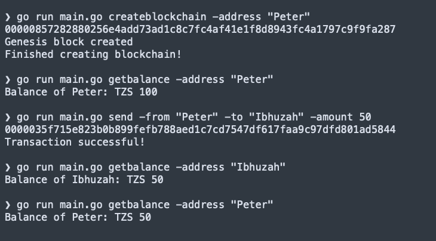

# golang-blockchain

An educational blockchain in Go that demonstrates blocks, Proof‑of‑Work mining, UTXO‑based transactions, and on‑disk persistence with BadgerDB. This project is intended for learning and small experiments — not for production use.

## Features
- Core data structures: `Block`, `Transaction`, and `Blockchain`
- UTXO transaction model (inputs/outputs) including coinbase rewards
- SHA‑256 hashing and block linkage
- Proof of Work miner with validation
- Persistent storage via BadgerDB (on-disk key-value store)
- Simple CLI: create chain, send, get balance, print chain
- Gob-based serialization of blocks and transactions

## Requirements
- Go 1.24+ (see `go.mod`)

## Quick start (CLI)
Initialize a chain with a coinbase to your address, send funds, check balances, and print the chain.

```bash
# 1) Create a new blockchain and mine the genesis coinbase to your address
go run main.go createblockchain -address Alice

# 2) Check balance (reads UTXOs)
go run main.go getbalance -address Alice

# 3) Send coins (creates a transaction, mined into a new block)
go run main.go send -from Alice -to Bob -amount 25

# 4) Query balances
go run main.go getbalance -address Alice
go run main.go getbalance -address Bob

# 5) Print the full chain from tip back to genesis
go run main.go printchain
```

Notes
- The blockchain is persisted under `./tmp/blocks` in the repo root.
- `createblockchain` creates a new DB and mines a genesis block that contains a coinbase transaction paying the specified address.

## What the program does
1. Creates or opens a BadgerDB-backed blockchain with a genesis coinbase to the provided address.
2. Builds UTXO transactions from inputs and outputs when you `send` value from one address to another.
3. Mines new blocks via Proof of Work until a valid hash under the target is found.
4. Persists blocks and allows reverse iteration from the tip to genesis.
5. Prints each block and validates its PoW.

## BadgerDB persistence (highlight)
- Database path: `./tmp/blocks` (both `Dir` and `ValueDir`).
- Keys and values:
  - `"lh"` → bytes of the last block’s hash (tip pointer).
  - `block.Hash` → serialized `Block` (Gob-encoded bytes, including transactions).
- Transactions:
  - Read-only: `View` to fetch values (e.g., current last hash, block by hash).
  - Read-write: `Update` to store new blocks and advance `"lh"`.
- Serialization:
  - `block.Serialize()` encodes a `Block` (with its `Transactions`) using `encoding/gob` before writing.
  - `Deserialize(data)` decodes bytes back into a `Block` when reading.
- Cleanup:
  - The DB handle is closed on exit (`Database.Close()` in `main.go`).

Resetting the chain
- Stop the program and delete the `./tmp/blocks` directory to start fresh:

```bash
rm -rf ./tmp/blocks
```

## CLI usage
```
Usage:
 getbalance -address ADDRESS - get the balance of an address
 createblockchain -address ADDRESS - create a blockchain
 printchain - Print the blocks in the chain
 send -from FROM -to TO -amount AMOUNT - Send coins from one address to another
```

Examples
```bash
go run main.go createblockchain -address Alice
go run main.go getbalance -address Alice
go run main.go send -from Alice -to Bob -amount 25
go run main.go printchain
```

## Architecture overview
### Data structures
- Block (`blockchain/block.go`)
  - `Hash []byte`: hash of the current block
  - `Transactions []*Transaction`: list of transactions included in this block
  - `PrevHash []byte`: hash of the previous block
  - `Nonce int`: value found by mining (set during PoW)
- Blockchain (`blockchain/blockchain.go`)
  - `LastHash []byte`: hash of the tip (for iteration and adding new blocks)
  - `Database *badger.DB`: BadgerDB instance holding all blocks
- Iterator (`blockchain/blockchain.go`)
  - Supports reverse traversal from tip to genesis using stored hashes

### Transactions & UTXO model
- Transaction (`blockchain/transaction.go`)
  - `ID []byte`: unique transaction hash
  - `Inputs []TxInput`: references to previously unspent outputs being spent now
  - `Outputs []TxOutput`: newly created outputs (who can spend the value next)
- TxInput
  - `ID []byte`: transaction ID of the referenced output
  - `Out int`: index within that transaction’s outputs
  - `Signature string`: simplified unlock data (demo; not real cryptography)
- TxOutput
  - `Value int`: amount
  - `PubKey string`: simplified lock to an address

Helper/constructor functions
- `CoinbaseTx(to, data string) *Transaction`: mines reward to `to` in genesis and as first tx of mined blocks
- `NewTransaction(from, to string, amount int, chain *Blockchain) *Transaction`: builds a transaction by gathering spendable UTXOs, creating change if needed, and setting the transaction ID
- `(*Blockchain).FindUTXO(address string) []TxOutput`: scans the chain to collect unspent outputs for an address
- `(*Blockchain).FindSpendableOutputs(address string, amount int) (acc int, validOutputs map[string][]int)`: selects sufficient UTXOs to cover an amount

### Hashing and linkage
- Transactions inside a block are hashed (joined) to produce a deterministic transaction root for PoW input via `(*Block).HashTransactions()`.
- The PoW miner (`NewProof.Run`) finds a valid nonce and sets `block.Hash` directly from the mined hash.

### Block creation and addition
- `Genesis(coinbaseTx)` creates the first block with a coinbase transaction.
- `CreateBlock(txs, prevHash)` constructs a block (with transactions) and runs PoW to fill `Nonce` and `Hash`.
- `(*Blockchain).AddBlock(transactions)` mines a block with the provided transactions and persists it to BadgerDB, updating the last-hash pointer `"lh"`.

## Proof of Work (concise)
- Difficulty constant in `blockchain/proof.go` (e.g., `const Difficulty = 20`).
- Target: `1 << (256 - Difficulty)`; valid block hash must be less than this target.
- Mining loop: increment `Nonce`, compute SHA‑256, compare to target, repeat until valid.
- Validation: `Validate()` recomputes using the stored `Nonce` and checks against the target.

Adjusting difficulty
```go
const Difficulty = 20
```
- Increase → harder (slower mining)
- Decrease → easier (faster mining)

## Example output
Your hashes will differ per run/machine. Below is a screenshot from a representative run showing CLI execution and PoW validation.



Tip: To display the nonce, ensure printing in `printchain` includes `block.Nonce` if desired.

## Using as a tiny library
Construct and extend a chain programmatically. Since persistence is via BadgerDB, use the iterator to traverse blocks:

```go
chain := blockchain.InitBlockChain("Alice")
defer chain.Database.Close()

// Build a transaction and mine it into a block
tx := blockchain.NewTransaction("Alice", "Bob", 10, chain)
chain.AddBlock([]*blockchain.Transaction{tx})

iter := chain.Iterator()
for {
    b := iter.Next()
    fmt.Printf("%x -> txs: %d\n", b.Hash, len(b.Transactions))
    if len(b.PrevHash) == 0 {
        break // reached genesis
    }
}
```

## Project layout
- `blockchain/block.go` — Block type, serialization helpers
- `blockchain/blockchain.go` — BadgerDB-backed blockchain, iterator, UTXO scanning
- `blockchain/proof.go` — Difficulty, target building, mining, validation
- `blockchain/transaction.go` — Transactions, inputs/outputs, coinbase, builders
- `main.go` — CLI entrypoint (`createblockchain`, `getbalance`, `send`, `printchain`)
- `execution.png` — Example output screenshot
- `go.mod`, `go.sum` — Go module and dependencies (includes BadgerDB v4)

## Limitations and learning notes
- No networking, mempool, or consensus beyond local PoW
- Simplified signatures/locking (strings instead of real cryptography)
- Fixed difficulty; no dynamic retargeting
- Simple persistence model (single process; no compaction controls beyond Badger defaults)

## Troubleshooting
- Mining appears slow: lower `Difficulty` in `blockchain/proof.go` for faster demos.
- Reset the chain: delete `./tmp/blocks` and rerun to recreate genesis.
- Closing the DB: ensure the program exits normally, or explicitly close `chain.Database` in your own code.
